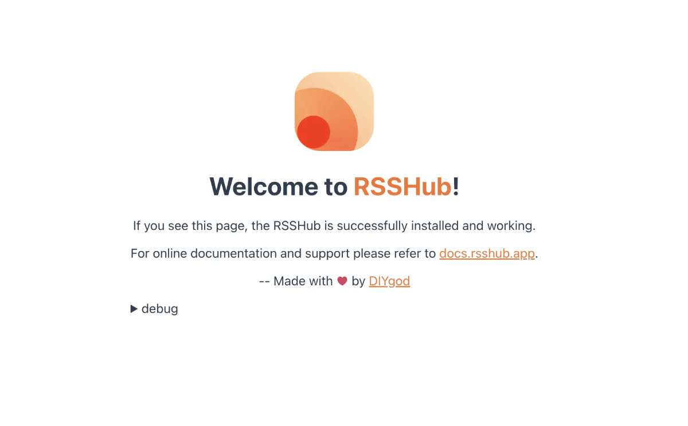

<!--
N.B.: This README was automatically generated by https://github.com/YunoHost/apps/tree/master/tools/README-generator
It shall NOT be edited by hand.
-->

# RSSHub for YunoHost

[](https://dash.yunohost.org/appci/app/rsshub)  

[](https://install-app.yunohost.org/?app=rsshub)

*[Lire ce readme en français.](./README_fr.md)*

> *This package allows you to install RSSHub quickly and simply on a YunoHost server.
If you don't have YunoHost, please consult [the guide](https://yunohost.org/#/install) to learn how to install it.*

## Overview

RSSHub is an open source, easy to use, and extensible RSS feed generator. It's capable of generating RSS feeds from pretty much everything. RSSHub can be used with browser extension RSSHub Radar and mobile auxiliary app RSSBud (iOS) and RSSAid (Android)


**Shipped version:** 2023.11.30~ynh1

## Screenshots



## Documentation and resources

* Official app website: <https://docs.rsshub.app/>
* Official admin documentation: <https://docs.rsshub.app/install/>
* Upstream app code repository: <https://github.com/DIYgod/RSSHub>
* YunoHost Store: <https://apps.yunohost.org/app/rsshub>
* Report a bug: <https://github.com/YunoHost-Apps/rsshub_ynh/issues>

## Developer info

Please send your pull request to the [testing branch](https://github.com/YunoHost-Apps/rsshub_ynh/tree/testing).

To try the testing branch, please proceed like that.

``` bash
sudo yunohost app install https://github.com/YunoHost-Apps/rsshub_ynh/tree/testing --debug
or
sudo yunohost app upgrade rsshub -u https://github.com/YunoHost-Apps/rsshub_ynh/tree/testing --debug
```

**More info regarding app packaging:** <https://yunohost.org/packaging_apps>
